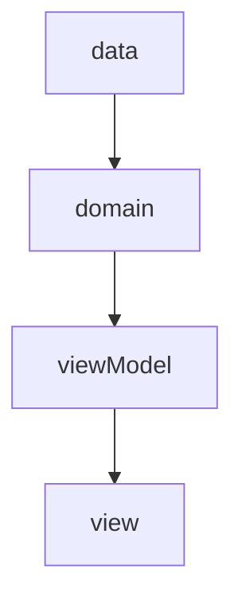

# CatDogFlutter
## Cat, Dog Image Api로 앱, 웹 환경에서 귀여운 사진을 많이 볼 수 있게 만드는 서비스

Network 통신을 통해서 사진 호출[API](https://developers.thecatapi.com/view-account/ylX4blBYT9FaoVd6OhvR?report=FJkYOq9tW)

## Architecture
아직은 FLutter의 Architecture에대해 잘 모르기 떄문에  Robert C. Martin의 Clean Architecture에 따라 구성하여 작업

Provider를 사용한 ViewModel로 Mvvm를 구성할 예정

이후 작업
1. DI 적용
2. Retrofit 사용해보기
